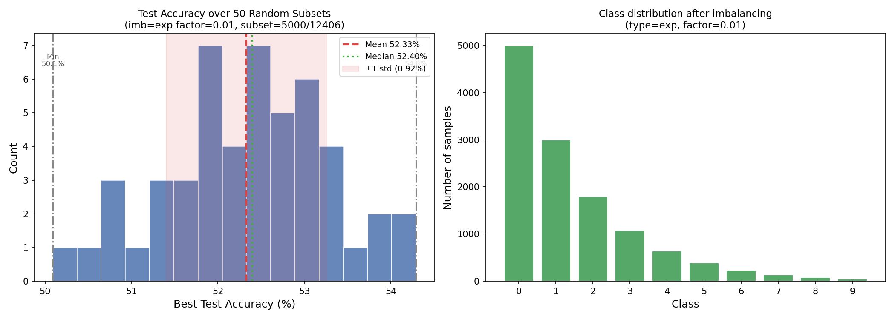

# Imbalanced CIFAR-10 and CIFAR-100 Subset Selection Experiments

Investigating whether intelligently selected subsets of training data can match or exceed the performance of random subsets of the same size, under long-tailed class imbalance.

## Motivation

Training on the full dataset is expensive. If a small, well-chosen subset preserves the diversity and coverage of the full training set, we can reduce compute without sacrificing accuracy. This project compares random subset selection against submodular optimization as a principled selection strategy, evaluated on an imbalanced variant of CIFAR-10 to reflect more realistic data distributions.

## Setup

Dataset: CIFAR-10 (imbalanced, exponential decay)  
Imbalance type: Exponential (`type=exp`, `factor=0.01`)  
Training set: 12,406 images  
Class counts: [5000, 2997, 1796, 1077, 645, 387, 232, 139, 83, 50]  
Test set: 10,000 images (full, balanced)  
Subset size: 5,000 samples (~40% of training set)  
Model: Small ResNet (3 residual blocks), trained from scratch  
Epochs: 100 per run  
Evaluation: Full test set (10,000 images)

### Imbalancing Procedure

The long-tailed imbalance follows the exponential decay schedule from [Cao et al. (2019)](https://arxiv.org/pdf/1906.07413), where the number of training samples for class $i$ is:

$$n_i = n_{\max} \cdot \mu^i, \quad \mu = \left(\frac{n_{\min}}{n_{\max}}\right)^{1/(K-1)}$$

With `factor=0.01`, the imbalance ratio between the most and least frequent class is 100:1.

## Experiment 1: Random Baseline

To establish a performance baseline under imbalance, the training set is randomly sampled 50 times. Each trial trains a fresh model and reports test accuracy.

| Metric | Value |
|--------|-------|
| Trials | 50 |
| Subset size | 5,000 / 12,406 |
| Mean accuracy | 52.33% |
| Std deviation | 0.92% |
| Min accuracy | 50.09% |
| Max accuracy | 54.29% |
| Median accuracy | 52.40% |

## Experiment 2: Submodular Subset Selection

Rather than sampling randomly, we use submodular optimization to select a subset that maximally covers the diversity of the full training set.

### Approach

Features are extracted from all 12,406 training images using a pretrained neural network, producing a compact embedding for each image. These embeddings are used to build a similarity matrix, which is then used to initialize a Facility Location submodular function, which is a classical formulation that rewards selecting representative elements that are close to as many unselected elements as possible.

Greedy algorithm is used to find the solution set, which then serves as the training subset. Under class imbalance, this approach may naturally over-represent minority classes relative to random sampling, as their embeddings occupy distinct regions of feature space.

### Results

| Method | Test Accuracy |
|--------|--------------|
| Random baseline (mean) | 52.33% |
| Submodular algorithm v1| 57.42% |
| Submodular algorithm v2| 59.86% |

## Scripts

| Script | Description |
|--------|-------------|
| `cifar10_subset_experiment_imbalanced.py` | Random baseline: 50 trials, reports mean/std/min/max/median and histogram |

## References

Cao, K., Wei, C., Gaidon, A., Arechiga, N., & Ma, T. (2019). Learning Imbalanced Datasets with Label-Distribution-Aware Margin Loss. *NeurIPS 2019*. https://arxiv.org/abs/1906.07413
