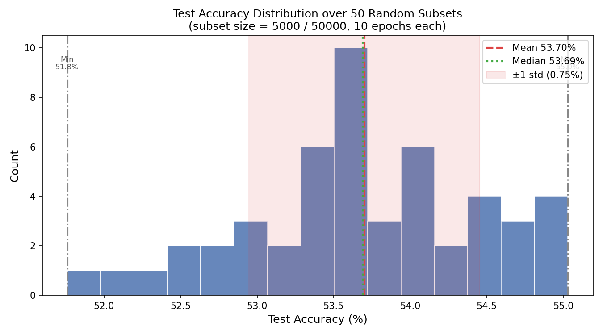

# CIFAR-10 Subset Selection Experiments

Investigating whether intelligently selected subsets of training data can match or exceed the performance of random subsets of the same size.

## Motivation

Training on the full dataset is expensive. If a small, well-chosen subset preserves the diversity and coverage of the full training set, we can reduce compute without sacrificing accuracy. This project compares random subset selection against submodular optimization as a principled selection strategy.

## Setup

Dataset: CIFAR-10 (50,000 training images, 10,000 test images)  
Subset size: 5,000 samples (10% of training set)  
Model: Small ResNet (3 residual blocks), trained from scratch  
Epochs: 10 per run  
Evaluation: Full test set (10,000 images)

## Experiment 1: Random Baseline

To establish a performance baseline, the training set is randomly sampled 50 times. Each trial trains a fresh model and reports test accuracy.

| Metric | Value |
|--------|-------|
| Trials | 50 |
| Subset size | 5,000 / 50,000 |
| Mean accuracy | 53.70% |
| Std deviation | 0.75% |
| Min accuracy | 51.76% |
| Max accuracy | 55.03% |
| Median accuracy | 53.69% |

The relatively tight standard deviation (±0.75%) confirms the baseline is stable and a fair reference point.

## Experiment 2: Submodular Subset Selection

Rather than sampling randomly, we use submodular optimization to select a subset that maximally covers the diversity of the full training set.

### Approach

Features are extracted from all 50,000 training images using a pretrained neural network, producing a compact embedding for each image. These embeddings are used to build a similarity matrix, which is then optimized using a Facility Location submodular function, a classical formulation that rewards selecting representative elements that are close to as many unselected elements as possible.

Greedy maximization is used to find the solution set, which then serves as the training subset.

### Results

| Method | Test Accuracy |
|--------|--------------|
| Random baseline (mean) | 53.70% |
| Submodular, best configuration | **54.88%** |

The best submodular configuration achieves +1.18 percentage points over the random mean, demonstrating that structured selection finds a consistently better subset than chance.

## Scripts

| Script | Description |
|--------|-------------|
| `cifar10_subset_experiment.py` | Random baseline: 50 trials, reports mean/std/min/max/median and histogram |
